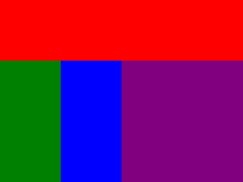

# Spis treści<!-- omit in toc -->

1. [Wprowadzenie](#wprowadzenie)
    - [Podstawowy program](#podstawowy-program)
    - [Wyświetlanie tekstu](#wyświetlanie-tekstu)
    - [Komentarze](#komentarze)
2. [Zmienna](#zmienna)
    - [Nazwy zmiennych](#nazwy-zmiennych)
    - [Typy danych](#typy-danych)
    - [Definicja zmiennej](#definicja-zmiennej)
3. [Operatory arytmetyczne](#operatory-arytmetyczne)
    - [Dodatkowe operatory przypisania](#dodatkowe-operatory-przypisania)
4. [Komunikacja z użytkownikiem](#komunikacja-z-użytkownikiem)
    - [Konwersje typów](#konwersje-typów)
    - [Polecenia](#polecenia---komunikacja-z-użytkownikiem)
5. [Instrukcje warunkowe](#instrukcje-warunkowe)
    - [Operatory relacyjne](#operatory-relacyjne)
    - [Warunki złożone](#warunki-złożone)
    - [Konstrukcja instrukcji warunkowej](#konstrukcja-instrukcji-warunkowej)
    - [Switch](#switch)
    - [Polecenia](#polecenia---instrukcje-warunkowe)
6. [Pętle](#pętle)
    - [Pętla while](#pętla-while)
    - [Pętla for](#pętla-for)
    - [Instrukcja break](#instrukcja-break)
    - [Polecenia](#polecenia---pętle)
7. [Funkcje](#funkcje)
    - [Zwracanie wartości](#zwracanie-wartości)
    - [Polecenia](#polecenia---funkcje)
8. [Listy](#listy)
    - [Indeksowanie](#indeksowanie)
    - [Iterowanie po listach](#iterowanie-po-listach)
    - [Polecenia](#polecenia---listy)
9. [Klasy i obiekty](#klasy-i-obiekty)
    - [Definicja klasy i konstruktor](#definicja-klasy-i-konstruktor)
    - [Pola](#pola)
    - [Metody](#metody)
    - [Polecenia](#polecenia---klasy-i-obiekty)
10. [Aplikacje okienkowe](#101-aplikacje-okienkowe)
    1.  [Aplikacje okienkowe](#101-aplikacje-okienkowe)
        - [Importowanie bibliotek](#importowanie-bibliotek)
        - [Tworzenie okna](#tworzenie-okna)
        - [Elementy okna #1](#elementy-okna-1)
        - [Ramki](#ramki)
        - [Polecenia #1](#polecenia---aplikacje-okienkowe-1)
    2. [Komunikacja z użytkownikiem](#102-komunikacja-z-użytkownikiem)
        - [Elementy okna #2](#elementy-okna-2)
        - [Wartości przycisków wyboru i opcji](#wartości-przycisków-wyboru-i-opcji)
        - [Polecenia #2](#polecenia---aplikacje-okienkowe-2)
    3. [Układanie elementów okna](#103-układanie-elementów-okna)
        - [Pack](#pack)
        - [Grid](#grid)
        - [Place](#place)
        - [Polecenia #3](#polecenia---aplikacje-okienkowe-3)
11. [Projekty](#11-projekty)

&nbsp;

<a name = "wprowadzenie"></a>
# 1. Wprowadzenie

Python to język programowania wysokiego poziomu, ogólnego przeznaczenia. Jego składnia cechuje się przejrzystością i zwięzłością. Posiada w pełni dynamiczny system typów i automatyczne zarządzanie pamięcią.

## Podstawowy program

```python
print("Hello world!")
```

<p align = "right">1.1. Przykładowa instrukcja</p>

Powyższy program ma za zadanie wypisać, przy pomocy *funkcji* `print`, podany pomiędzy nawiasami okrągłymi napis. Jak widać, struktura programu jest znacznie prostsza niż w przypadku większości języków programowania.

> Kolejną istotną różnią jest brak średników kończących daną instrukcję.

## Wyświetlanie tekstu

Najprostszym sposobem na komunikację z użytkownikiem jest konsola, która pomocna może okazać się również w celu prześledzenia pracy programu na różnych jego etapach.

```python
print("Przykładowy" + "tekst")
print("Inny", "przykładowy", "tekst")
print('To również napis')
```

<p align = "right">1.2. Wyświetlanie tekstu</p>

Język Python pozwala na dwa główne sposoby deklarowania napisów. Do tworzenia ciągów znaków można wykorzystać **apostrofy** lub **cudzysłowy**. W większości języków apostrof zarezerwowany jest dla pojedynczych znaków.

**Łańcuchy znaków** można poddać **konkatenacji**, czyli ich łączeniu, sklejaniu ze sobą. W tym celu wykorzystuje się dwuargumentowy operator `+`. Wynikiem jest nowy ciąg znaków.

Funkcja `print` pozwala na przekazanie kilku argumentów, oddzielonych przecinkami.

## Komentarze

```python
print("Przykładowy tekst.") # Przykładowa instrukcja
# print("Inny przykładowy tekst.")
```

<p align = "right">1.3. Komentarze</p>

Komentarze nie są brane pod uwagę w trakcie działania programu. Mogą okazać się pomocne przy opisie kodu, czy poszczególnych instrukcji lub tymczasowej zmiany działania programu.

&nbsp;

<a name = "zmienna"></a>
# 2. Zmienna

**Zmienna** to pewne wydzielone miejsce w pamięci komputera, gdzie mogą być przechowywane dane, między innymi wyniki wykonywanych operacji. Wartością zmiennej może być na przykład liczba lub ciąg znaków. Zmienna musi posiadać nazwę symboliczną, przez którą można odwoływać się do niej w programie.

## Nazwy zmiennych

Nazwa może być dowolna, ale musi spełniać następujące warunki:

- nazwa zmiennej nie może być słowem kluczowym języka Python,
- nazwa nie może zaczynać się od cyfry,
- nazwa nie może zawierać znaków białych i większości znaków specjalnych.

> **Słowa kluczowe** to zastrzeżone słowa, które mają specjalne znaczenie w danym językach programowania.

Ponadto należy pamiętać, że wielkie i małe litery są rozróżnialne. Poza powyższymi wymogami zaleca się nadawanie nazw jawnie określających przeznaczenie danej zmiennej i odradza stosowanie polskich znaków (staramy się korzystać tylko z alfabetu łacińskigo).

W przypadku nazw wieloczłonowych możemy posłużyć się jedną z popularnych notacji:

- **camelCase** - wszystkie wyrazy piszemy łącznie, każdy kolejny zaczynając od wielkiej litery,
- **PascalCase** - wszystkie wyrazy piszemy łącznie, każdy (łącznie z pierwszym) zaczynając od wielkiej litery,
- **snake_case** - wyrazy oddzielamy znakiem myślnika,
- **kebab-case** - wyrazy oddzielamy znakiem myślnika.

## Typy danych

Python cechuje **typowanie dynamiczne**, oznacza to, że nie musimy jawnie wskazywać typu danej zmiennej. Jest on nadawany automatycznie w zależności od przechowywanej przez nią wartości. Podstawowe typy wbudowane oferowane przez język to:
- `str` (string) - ciąg/łańcuch znaków, napis,
- numeryczne:
  - `int` (integer) - liczba całkowita,
  - `float` (floating point number) - liczba zmiennoprzecinkowa, liczba "rzeczywista",
- `bool` (boolean) - wartość logiczna.

```python
text = "Przykładowy tekst" # str
randomNumber = 21 # int
fraction = 9.34 # float
anotherFraction = .37 # float
statement = True # bool
```

<p align = "right">2.1. Podstawowe typy danych</p>

## Definicja zmiennej

W języku Python nie możemy zdefiniować zmiennej bez jej inicjalizacji, czyli przypisania wartości początkowej. Na początek odwołujemy się do nazwy symbolicznej, operatorem przypisania jest `=`, po którym następuje podanie wartości.

> W większości języków programowania, również w Python, części dziesiętne ułamków zapisujemy po znaku kropki.

> W przypadku wartości liczbowych z zakresu (1; 1), możemy pominąć zero wiodące. `0.37` jest równoważne z zapisem `.37`. Adekwatnie dla liczb ujemnych, `-0.37` oznacza to samo, co `-.37`.

> Typ logiczny może przyjmować jedynie dwie wartości `True` - prawdę lub `False` - fałsz.

&nbsp;

<a name = "operatory-arytmetyczne"></a>
# 3. Operatory arytmetyczne

Podobnie jak inne języki, Python oferuje kilka podstawowych operatorów arytmetycznych, znanych z matematyki:
- `+` - dodawanie,
- `-` - odejmowanie,
- `*` - mnożenie,
- `**` - potęgowanie
- `/` - dzielenie,
- `//` - dzielenia całkowite,
- `%` - dzielenie modulo, reszta z dzielenia.

> Większość oznaczeń operatorów jest intuicyjna. W przypadku `modulo` nie należy sugerować się oznaczeniem i mylić operator z pojęciem procenta.

Dzielenie modulo najczęściej wykorzystywane jest do sprawdzania podzielności liczb. Jeżeli reszta z dzielenia równa jest zero, to znaczy, że pierwsza liczba dzieli się całkowicie przez drugą liczbę.

```python
a = 3
b = -4

result = a + b

print("Suma:", result)
print("Ta sama suma:", a + b)
```

<p align = "right">3.1. Operacje arytmetyczne</p>

> W celu wyświetlenia wartości zmiennej odwołujemy się do jej nazwy symbolicznej i podajemy ją jako arguement funkcji `print`.

Powyższy przykład przedstawia dodawanie dwóch liczb. Na początku definiujemy dwie zmienne i inicjalizujemy je ustalonymi wartościami całkowitymi. W celu wyświetlenia sumy (wyniku dodawania) możemy zadeklarować kolejną zmienną, ale możemy również wykonać operację bezpośrednio w nawiasach funkcji `print`.

## Dodatkowe operatory przypisania

Często będziemy musieli zmieniać wartość danej zmiennej, nadpisując ją inną wartością.

```python
number = 5
number = number + 2

print(number)
```

<p align = "right">3.2. Operacje przypisania</p>

Przykładowo, liczbę możemy nadpisać wartością o *2* większą, przypisując jej nową wartość w postaci sumy jej starej wartości i liczby *2*. Taki zapis można skrócić przy pomocy danych operatorów:
- `+=`,
- `-=`,
- `*=`,
- `**=`,
- `/=`,
- `//=`,
- `%=`.

```python
number = 5
number += 2

print(number)
```

<p align = "right">3.3. Dodatkowe operacje przypisania</p>

Powyższy zapis jest równoważny. Wynik działania będzie identyczny poprzednim. W obu wypadkach zwiększamy liczbę o *2*.

> Szczególnym przypadkiem zmiany wartości jest zwiększenie lub zmniejszenie jej o 1. Mowa wtedy odpowednio o **inkrementacji** oraz **dekrementacji**. W większości języków, poza Python, istnieją dla nich oddzielnie operatory.

&nbsp;

<a name = "komunikacja-z-użytkownikiem"></a>
# 4. Komunikacja z użytkownikiem

```python
value = input("Wprowadź wartość: ")

print("Podana wartość to:", value)
```

<p align = "right">4.1. Wprowadzanie wartości</p>

Za pobieranie wartości wprowadzanych przez użytkownika za pośrednictwem klawiatury odpowiada funkcja `input`. Jako argument możemy podać napis, który wyświetli się w konsoli. Może mieć za zadanie na przykład poinformowanie użytkownika o spodziewanej akcji. Funkcja zwraca wartość wprowadzoną przed kliknięciem przycisku enter. Jeżeli chcemy z niej skorzystać na dalszym etapie programu, musimy przypisać ją do zmiennej.

```python
x = input("Wprowadź pierwszą liczbę: ")
y = input("Wprowadź drugą liczbę: ")

print("Suma liczb wynosi:", x + y)
```

<p align = "right">4.2. Przetwarzanie wprowadzanych wartości</p>

W powyższym przykładzie pomimo próby wprowadzenia liczb, wyświetlony napis nie będzie oczekiwanym wynikiem. W tym przypadku znak `+` nie oznacza dodawania, a **konkatenację**, w związku z tym zmienne zawierają ciągi znaków, a nie liczby.

Znak *"7"*, a liczba *7* to dla danego języka programowania dwie różne wartości. Znaki pomimo, że są cyframi nie zachowują się jak liczby i nie jesteśmy w stanie swobodnie przeprowadzać na nich operacji arytmetycznych.

## Konwersje typów

Aby dane wprowadzone przez użytkownika zostały poprawnie zinterpretowane należy je najpierw przekonwertować. W tym celu posłużą nam funkcje wbudowane:

- `str` - konwersja na łańcuch znaków,
- `int` - konwersja na liczbę całkowitą,
- `float` - konwersja na liczbę "rzeczywistą",
- `bool` - konwersja na typ logiczny.

```python
text = "4"
number = int(text)

print(number ** 2)
```

<p align = "right">4.3. Rzutowanie typów</p>

Gdzie pomiędzy nawiasami okrągłymi wskazujemy to, co chcemy poddać konwersji.

> W przypadku konwersji na typ logiczny przyjęło się założenie, że każda niezerowa lub niepusta wartość posiada wartość `True`, a zero lub na przykład pusty ciąg znaków - wartość `False`.

```python
text = input("Podaj wartość ułamkową: ")
fraction = float(text)

# fraction = float(input("Podaj wartość ułamkową: "))

print("Odwrotność danego ułamka to:", fraction ** -1)
```

<p align = "right">4.4. Skrócony zapis konwersji</p>

Powyższy zapis można skrócić podając pomiędzy nawiasy funkcji `float` wartość podaną przez użytkownika, czyli wywołanie funkcji `input`.

## Polecenia - komunikacja z użytkownikiem

1. Napisać program, który pobiera od użytkownika wartość całkowitą i wyświetla jej pierwiastek trzeciego stopnia.
2. Napisać program, który pobiera od użytkownika dwie wartości liczbowe i wyświetla ich średnią arytmetyczną.
3. Napisać program, który pobiera od użytkownika długość promienia pewnego okręgu i wyświetla jego pole powierzchni. Dla ułatwienia zakładamy, że wprowadzony promień nie będzie wartością ujemną.

&nbsp;

<a name = "instrukcje-warunkowe"></a>
# 5. Instrukcje warunkowe

**Instrukcje warunkowe** w programowaniu służą do warunkowego wykonywania instrukcji, w zależności od tego, czy dany warunek jest spełniony.

Instrukcja warunkowa jest spełniona, gdy zawarty w niej warunek jest prawdziwy - zwraca wartość logiczną `True`. W przypadku wartości fałszywej - `False`, wskazane instrukcje nie zostaną wykonane.

```python
condition = True

if condition:
    print("Warunek jest spełniony")
```

<p align = "right">5.1. Instrukcja warunkowa</p>

Po słowie kluczowym `if` następuje **warunek**, linię kończymy znakiem dwukropka, który wyznacza **blok kodu** Wszystkie instrukcje, które mają zostać wykonane w obrębie instrukcji warunkowej (mają zostać wykonane pod warunkiem) posiadają wcięcie. Warunkiem może być zmienna lub całe wyrażenie.

> W powyższym przykładzie sprawdzana jest wartość zmiennej `condition`. Została ona zainicjowana wartością `True` - wartość jest prawdą, co jest równoznaczne ze spełnieniem warunku.

## Operatory relacyjne

Do dyspozycji mamy kilka operatorów służących porównywaniu danych wartości:

|operator|nazwa|
|-|-|
|`==`|równe|
|`!=`|różne|
|`>`|większe niż|
|`>=`|większe lub równe|
|`<`|mniejsze niż|
|`<=`|mniejsze lub równe|

> Pojedynczy znak równości zarezerwowany jest dla operacji przypisania, więc do porównywania wartości służą dwa znaki.

```python
age = 18

if age >= 18:
    print("Osoba jest pełnoletnia")
```

<p align = "right">5.2. Porównywanie wartości</p>

Operatory relacyjne zwracają określoną wartość logiczną, zatem mogą służyć formułowaniu warunków.

## Warunki złożone

Dane warunki proste, opierające się na przykład na porównaniach, możemy łączyć w bardziej złożone i precyzyjne konstrukcje.

|operator|nazwa|opis|
|-|-|-|
|`and`|koniunkcja|i, oraz - oba warunki muszą być spełnione|
|`or`|alternatywa|lub - przynajmniej jeden z warunków musi być spełnony|
|`not`|negacja|zaprzeczenie - odwrócenie wartości logicznej|

```python
x = -2

if x == 2 or x == -2:
    print("Moduł liczby x wynosi 2.")
```

<p align = "right">5.3. Warunki złożone</p>

Powyższy warunek jest spełniony, gdy dana liczba jest równa *2* lub *-2*

## Konstrukcja instrukcji warunkowej

```python
number = 2.13

if number > 0:
    print("Liczba jest dodatnia.")

elif number < 0:
    print("Liczba jest ujemna.")

else:
    print("Liczba jest równa 0.")
```

<p align = "right">5.4. Konstrukcja instrukcji warunkowej</p>

Po instrukcji `if` można dodawać warunki alternatywne za pośrednictwem instrukcji `elif`. Na samym końcu można dodatkowo zdefiniować działanie dla pozostałych przypadków - czyli sytuacji, w której żaden z poprzednich warunków nie został spełniony.

&nbsp;

## Switch

W przypadku bardzo precyzyjnych warunków instrukcje warunkowe mogą okazać się niewystarczająco czytelne. Alternatywą może być konstrukcja `switch`, dostępna w języku Python od wersji *3.10*.

```python
term = "b"

match term:

    case "a":
        print("Wprowadzono literę 'a'.")

    case "b":
        print("Wprowadzono literę 'b'.")

    case _:
        print("Wprowadzono inną wartość.")
```

<p align = "right">5.5. Instrukcja Switch</p>

Po słowie kluczowym `match` wskazujemy zmienną, której wartość zadecyduje o przeprowadzonych operacjach. W zależności od jej wartości wybierany jest odpowiedni przypadek - `case`. Na końcu umieszczamy przypadek domyślny - znak `_` ozncza w tym przypadku dowolną inną wartość.

## Polecenia - instrukcje warunkowe

1. Napisać program, który pobiera wartość całkowitą i wyświetla informację, czy podana liczba jest parzysta.
2. Napisać program, który pobiera od użytkownika trzy wartości liczbowe i wyświetla je w kolejności rosnącej.
3. Napisać kalkulator prosty z wykorzystaniem instrukcji `switch`. Użytkownik podaje dwie liczby "rzeczywiste" oraz znak (`+`, `-`, `*` lub `/`), który decyduje od przeprowadzonym działaniu, wyświetlany jest wynik.

&nbsp;

<a name = "pętle"></a>
# 6. Pętle

Pętle w programowaniu służą do cyklicznego wykonywania ciągu instrukcji określoną liczbę razy.

> Każdy obrót pętli nazywamy **iteracją**.

W języku Python możemy wyróżnić dwa podstawowe typy pętli.

## Pętla while

Pętla wykonuje blok instrukcji dopóki podany warunek, podany po słowie kluczowym `while`, jest spełniony (ma wartość prawdziwą - `True`).

Warunek pętli konstruujemy tak samo, jak warunki w instrukcjach warunkowych `if`. Możemy korzystać z operatorów **relacyjnych** i **logicznych**.

```python
number = 5

while number > 0:

    print("Wartość: ", number)
    number -= 1
```

<p align = "right">6.1. Pętla While</p>

Na powyższym przykładzie pętla wykonywana jest dopóki wartość zmiennej liczbowej `number` jest dodatnia. Zmienna posiada wartość przypisaną przed wywołaniem pętli. Wewnątrz pętli wartość jest zmieniana (w tym przypadku następuje `dekrementacja`).

## Pętla for

Pętli `for` używa się do **iterowania** po **sekwencjach**.

> **Sekwencyjne typy danych** służą do przechowywania wielu wartości jednocześnie. Przykładami są **listy** i ciągi znaków.

```python
text = "Ala ma kota"

print("Kolejne znaki:")

for character in text:

    print(character)
```

<p align = "right">6.2. Pętla For</p>

Po słowie kluczowym `for` należy zadeklarować zmienną, która w poszczególnych iteracjach pętli będzie przyjmowała kolejne wartości z sekwencji. W powyższym przykładzie są to pojedyncze znaki z przykładowego napisu.

```python
someRange = range(10)

for number in someRange:

    print(number)
```

<p align = "right">6.3. Iterowanie po sekwencjach</p>

Funkcja `range` zwraca sekwencję liczb (zakres), którą możemy posłużyć się w pętli `for`. Pomiędzy nawiasami, jako argument, podajemy koniec interesującego nas przedziału.

```python
someRange = range(10)

for number in someRange:

    if 3 < number and number <= 6:
        print(number)
```

<p align = "right">6.4. Przykład zagnieżdżania instrukcji</p>

## Instrukcja Break

Instrukcja `break` odpowiada za natychmiastowe przerwanie pętli, niezależnie od stanu warunku lub iteratora.

```python
someRange = range(10)

for number in someRange:

    if number == 7:
        break

    print(number)
```

<p align = "right">6.5. Instrukcja Break</p>

## Polecenia - pętle

1. Napisać program zawierający pętlę `while`, która wyświetla liczby z zakresu *od -10 do 15*.
2. Napisać program zawierający pętlę `for`, która wyświetla liczby *nieparzyste* z zakresu *od 0 do 40*.
3. Napisać program zawierający pętlę `for`, który wyświetli *5 pierwszych znaków* napisu *"Ala ma kota"*.

&nbsp;

<a name = "funkcje"></a>
# 7. Funkcje

**Funkcja** to wydzielony fragment kodu, który można używać wielokrotnie w różnych miejscach programu.

Do tej pory korzystaliśmy z **funkcji wbudowanych**, na przykład `print` i `input`, ale jesteśmy w stanie definiować również własne funkcje.

```python
def showMessage ():
    print("Przykładowa wiadomość")
```

<p align = "right">7.1. Konstrukcja funkcji</p>

Po słowie kluczowym `def`, podobnie jak w przypadku zmiennej, musimy podać nazwę symboliczną. Po niej znajduje się nawias okrągły, w którym można określać **parametry** przyjmowane przez tę funkcję.

```python
showMessage()
```

<p align = "right">7.2. Wywoływanie funkcji</p>

Napisanie **definicji funkcji** nie jest wystarczające, by zawarte w niej instrukcje zostały wykonane. Funkcję wywołujemy w odpowiednim miejscu, odwołując się do jej nazwy symbolicznej.

```python
def showSum (a, b):
    print(a + b)

showSum(2, 1)
```

<p align = "right">7.3. Wywoływanie funkcji dla zadanych argumentów</p>

Jeżeli funkcja przyjmuje parametry, należy je przekazać podczas wywołania. Mowa wtedy o **argumentach**.

> Parametr to zmienna tworzona w obrębie funkcji. Wartości przekazywane przy wywołaniu funkcji nazywamy argumentami.

```python
def showSum (a, b):
    print(a + b)

x = 3
y = 7

showSum(x, y)
```

<p align = "right">7.4. Przekazywanie zmiennych jako argumentów funkcji</p>

Jako parametry funkcji przekazywane są zazwyczaj zmienne o określonych wcześniej wartościach.

> Argumenty funkcji widoczne są jedynie wewnątrz jej bloku. Oznacza to, że mają **zakres lokalny** i można się do nich odwoływać jedynie w obrębie funkcji.

## Zwracanie wartości

Fukcje poza wykonywaniem określonych instrukcji po wywołaniu mają również możliwość zwracania wartości poprzez słowo kluczowe `return`.

```python
def sum (a, b):
    return a + b

x = 3
y = 7

s = sum(x, y)
print(s)
```

<p align = "right">7.5. Zwracanie wartości przez funkcję</p>

By wykorzystać zwróconą wartość można ją na przykład przypisać do zmiennej.

```python
def sum (a, b):

    s = a + b
    return s

x = int(input("Podaj x: "))
y = int(input("Podaj y: "))

print(sum(x, y))
```

<p align = "right">7.6. Przechwytywanie wartości funkcji</p>

Zwracać można na przykład stałe, wartości zmiennych lub wartości wyrażeń, a zwracaną wartość można wykorzystać bezpośrednio w danym wyrażeniu, bez konieczności przypisywania jej wcześniej do zmiennej.

## Polecenia - funkcje

- Napisać funkcję wyświetlającą liczby nieparzyste z zakresu *[-15; 15)*.
- Napisać funkcję przyjmującą dwa argumenty liczbowe (podstawę oraz wykładnik), i wyświetlającą na ich podstawie wartość potęgi (parametrami powinny być liczby "rzeczywiste").
- Napisać funkcję przyjmującą jeden argument będący prawym końcem przedziału domkniętego. Funkcja ma za zadanie wyświetlić wszystkie wartości z tego zakresu, które nie dzielą się przez 3 (lewym końcem przedziału ma być zero - zatem przekazany parametr ma być liczbą naturalną).

W przypadku dwóch ostatnich funkcji przekazanymi parametrami mają być wartości pobrane od użytkownika.

&nbsp;

<a name = "listy"></a>
# 8. Listy

Jednym z przykładów wspomnianych wcześniej sekwencyjnych typów danych są listy. Można interpretować je jako uporządkowane zbiory pewnych elementów.

W języku Python listę definiujemy poprzez nawiasy kwadratowe, wewnątrz nich wypisujemy kolejne elementy listy oddzielone przecinkami. Listy, podobnie jak w przypadku innych wartości, możemy przypisać do zmiennej.

```python
numbers = [3, 7, 2, 1]
letters = ['x', 'd', 'd']
matrix = [
    [0, 9],
    [3, 4]
]
idk = ["sample", 8, "tekst"]
```

<p align = "right">8.1. Deklaracja listy</p>

Elementami list mogą być typy proste lub inne typy złożone, na przykład kolejne listy.

## Indeksowanie

Każdy element listy ma przyporządkowaną liczbę - **indeks**, określającą pozycję elementu w liście.

> W informatyce przyjęło się indeksować elementy od zera, zatem pierwszy element ma indeks *0*, drugi - *1* i tak dalej.

```python
numbers = [4, 2, 0]

firstNumber = numbers[0]

print("Pierwsza liczba: ", firstNumber)
```

<p align = "right">8.2. Odwołanie do elementu listy</p>

Chcąc odwołać się do danego elementu listy, podajemy nazwę symboliczną zmiennej przechowującej listę i nawiasy kwadratowe z konkretnym indeksem.

```python
letters = ['a', 'b', 'c', 'd', 'e']

print("Druga litera:", letters[1])
print("Ostatnia litera:", letters[-1])
print("Przedostatnia litera:", letters[-2])
```

<p align = "right">8.3. Alternatywne odwołania do indeksów listy</p>

Python umożliwia również wygodne odwoływanie się do elementów zaczynając od końca listy, poprzez podanie ujemnego indeksu. Tym razem zaczynamy od *-1* i schodzimy w dół.

> Przy pobieraniu elementu z listy należy uważać na poprawność podanego indeksu. Nie może on wykraczać poza dostępne indeksy danej listy - nie jesteśmy na przykład w stanie odwołać się do indeksu *11* w liście zawierającej zaledwie *9* elementów.

```python
numbers = [2, 7, 3, 1]

count = len(numbers)

print("Długość listy:", count)
```

<p align = "right">8.4. Długość listy</p>

Korzystając z wbudowanej funkcji `len` możemy pobrać długość danej listy.

> W związku z indeksowaniem od zera, kolejne indeksy listy to liczby całkowite od zera do długości listy minus jeden - na przykład dla listy trzyelementowej dostępne indeksy to *0*, *1* oraz *2*.

## Iterowanie po listach

Listy są **sekwencjami**. Oznacza to, że są złożone z wielu uporządkowanych elementów.

---

Często konieczne będzie operowanie na wszystkich elementach danej listy. Odwołania do konkretnych elementów nie zawsze są wygodne i możliwe do zrealizowania. Ponocne w tym zadaniu są pętle.

```python
numbers = [7, 3, 2, 5, 4]

for number in numbers:
    print(number)
```

<p align = "right">8.5. Iterowanie po elementach listy</p>

W powyższym przykładzie zmienna `number` przyjmuje jako wartość kolejno wszystkie elementy z listy `numbers`.

```python
numbers = [7, 3, 2, 5, 4]

length = len(numbers)

for index in range(length):

    print("Element o indeksie", index, "wynosi:", numbers[index])
```

<p align = "right">8.6. Iterowanie po indeksach listy</p>

Do poszczególnych elementów możemy odwoływać się również za pośrednictwem indeksów.

W tym celu należy pobrać długość listy za pomocą funkcji `len` i sprecyzować na jej podstawie interesujący nas zakres (od zera do długości listy). Elementami (nieujemne liczby całkowite) tego zakresu są indeksy dostępne dla danej listy.

```python
numbers = [7, 3, 2, 5, 4]

length = len(numbers)
index = 0

while index < length:

    print("Element o indeksie", index, "wynosi:", numbers[index])
    index += 1
```

<p align = "right">8.7. Iterowanie po indeksach przy pomocy pętli While</p>

Adekwatnie dla pętli while. W tym przypadku nie jesteśmy w stanie iterować bezpośrednio po sekwencji, zatem musimy skorzystać z indeksów.

## Polecenia - listy

Mamy daną listę liczb całkowitych: `[-2, 3, 4, -1, 2, 0, 3, -7, 2, 5]`.

- Przy pomocy pętli `for` wyświetlić z listy jedynie wartości nieujemne.
- Przy pomocy pętli `while` wyświetlić z listy jedynie wartości parzyste.
- Przy pomocy pętli `while` wyświetlić z listy co trzeci element.

<a name = "klasy-i-obiekty"></a>
# 9. Klasy i obiekty

**Obiekty** to struktury przechowujące pewne dane i posiadające zdefiniowane działanie. Dane, które można interpretować jako zmienne należące do obiektu nazywamy **polami**, a działanie, czyli inaczej funkcje zdefiniowane wewnątrz obiektu - **metodami**.

**Klasy** to byt abstrakcyjny. Są to pewnego rodzaju przepisy na utworzenie obiektów. Obiekt utworzony na podstawie danej klasy nazywamy jego **instancją**.

## Definicja klasy i konstruktor

Obiekty w programowaniu często reprezentują jakiś rzeczywisty byt.

```python
class Obj:

    def __init__ (self):

        print("Utworzono obiekt!")
```

<p align = "right">9.1. Deklaracja klasy</p>

Klasę definiujemy poprzez słowo klczowe `class` oraz podanie nazwy symbolicznej zakończonej dwukropkiem. Metodą, która zazwyczaj pojawia się w klasie jest `__init__`. Jest to tak zwany **konstruktor**. Jest on wywoływany, gdy tworzony jest obiekt.

> Wszystkie metody zdefiniowane w klasie przyjmują przynajmniej jeden argument - `self`, jest on wymagany.

Oczywiście sama klasa to jedynie przepis. Należy jeszcze utworzyć na jej podstawie obiekt.

```python
obj = Obj()
```

<p align = "right">9.2. Tworzenie obiektu na podstawie klasy</p>

## Pola

Pola deklarujemy podobnie jak zmienne, podając nazwę symboliczną i przypisując do nich jakąś wartość.

```python
class Circle:

    pi = 3.14

a = Circle()

print(a.pi)
```

<p align = "right">9.3. Odwołania do pól obiektu</p>

Po utworzeniu obiektu możemy odwołać się do zawartych w nim danych.

> Do składowych obiektów jak pola czy metody odwołujemy się po kropce.

Oczywiście mamy możliwość modyfikowania danych w obiekcie.

```python
a.pi = 3.141593
```

<p align = "right">9.4. Zarządzanie wartością pól obiektów</p>

## Metody

Podczas tworzenia obiektu możemy przekazać parametry, których wartości można następnie wykorzystać w jego obrębie. Zarządzanie tymi argumentami realizuje konstruktor.

```python
class Circle:

    pi = 3.14

    def __init__ (self, radius):

        self.r = radius

    def showLength (self):

        print(2 * self.pi * self.r)

a = Circle(2)

a.showLength()
```

<p align = "right">9.5. Wywoływanie metod obiektu</p>

Przy odwoływaniu się do pól wewnątrz klasy używamy słowa kluczowego `self`.

## Polecenia - klasy i obiekty

1. Napisz deklarację klasy **Pojazd**, zawierającą przynajmniej trzy tematyczne pola oraz metodę wyświetlającą te dane.
2. Napisz deklarację klasy **Kwadrat**, umożliwiającą sprecyzowanie długości boku. Ponadto ma zawierać metody wyświetlające pole danego kwadratu oraz całkowitą długość boków.

<a name = "aplikacje-okienkowe"></a>
# 10.1. Aplikacje okienkowe

Biblioteka *Tkinter*, będąca standardowym interfejsem zestawu narzędzi *Tck/Tk*, odznacza się wieloplatformowością, co pozwala na korzystanie z programu na różnych systemach operacyjnych.

## Importowanie bibliotek

Jeżeli potrzebujemy funkcjonalności spoza biblioteki standardowej możemy posłużyć się zewnętrznymi bibliotekami, jednak należy je najpierw zaimportować.

```python
import tkinter as tk
```

<p align = "right">10.1.1. Importowanie biblioteki</p>

Rozpoczynamy od słowa kluczowego `import` i podajemy nazwę interesującej nas biblioteki. Opcjonalnie możemy ją skrócić określając alias słowem `as`.

```python
from tkinter import ttk
```

<p align = "right">10.1.2. Importowanie elementów bibliotek</p>

W przypadku, gdy interesuje nas konkretny element biblioteki możemy go sprecyzować zaczynając od słowa `from`, podać nazwę biblioteki, a na koniec dany element.

> Importowanie potrzebnych bibliotek powinno odbywać się w pierwszej kolejnośći - w pierwszych liniach pliku.

## Tworzenie okna

```python
import tkinter as tk

root = tk.Tk()

root.mainloop()
```

<p align = "right">10.1.3. Tworzenie okna</p>

Do stworzenia okna korzystamy z obiektu biblioteki *Tkinter*.

```python
import tkinter as tk

root = tk.Tk()

root.geometry("400x200")
root.title("Sample title")

root.mainloop()
```

<p align = "right">10.1.4. Zarządzanie własnościami okna</p>

Do dyspozycji mamy metody, pozwalające na dostosowywanie okna. Między innymi jego wymiary oraz tytuł.

<a name = "elementy-okna-1"></a>
## Elementy okna #1

### Etykiety

Aby wstawić prosty tekst można skorzystać z klasy `Label`.

```python
import tkinter as tk

root = tk.Tk()

root.geometry("200x100")
root.title("Sample title")

label = tk.Label(root, text = "Sample text")

label.pack()

root.mainloop()
```

<p align = "right">10.1.5. Wypełnianie okna zawartością</p>

Tworząc obiekt podajemy element nadrzędny oraz dodatkowe opcje, takie jak `text`.

Do umieszczenie elementu w oknie możemy skorzystać z metody `pack`.

```python
label.pack(side = "left")
```

<p align = "right">10.1.6. Zarządzanie układem elementów</p>

Poprzez podanie odpowiednich parametrów można dodatkowo zarządzać sposobem wyświetlania elementu.

### Przyciski

W przypadku przycisków postępujemy adekwatnie, tym razem wykorzystując klasę `Button`.

```python
import tkinter

root = tkinter.Tk()

root.geometry("200x100")
root.title("Sample title")

button = tkinter.Button(root, text = "Button")

button.pack()

root.mainloop()
```

<p align = "right">10.1.7. Umieszczanie przycisków</p>

Metodą `pack` pusługujemy się jak w przypadku innych elementów.

```python
button.pack(anchor = "center", pady = 30)
```

<p align = "right">10.1.8. Alternatywny sposób pozycjonowania elementów</p>

Oczywiście możliwa jest obsługa zdarzenia naciśnięcia stworzonego przycisku.

```python
def clicked ():

    print("Clicked!")

button = tkinter.Button(root, text = "Button", command = clicked)
```

<p align = "right">10.1.9. Nadawanie obsługi zdarzeń</p>

Podczas tworzenia przycisku, przy pomocy parametru `command`, wystarczy podać nazwę funkcji, która ma się wykonać po jego wciśnięciu.

```python
tkinter.Button(root, text = "Exit", command = root.destroy)
```

<p align = "right">10.1.10. Zdarzenia wbudowane</p>

Przykładem może być wbudowana metoda `destroy`, odpowiadająca za zamknięcie okna.

```python
import tkinter

root = tkinter.Tk()

root.geometry("200x100")
root.title("Sample title")

label = tkinter.Label(root, text = "Text")

label.pack()

def clicked ():

    label.config(text = "Another text")

button = tkinter.Button(root, text = "Button", command = clicked)

button.pack()

root.mainloop()
```

<p align = "right">10.1.11. Modyfikacja elementów</p>

Przydatna może okazać się również możliwość modyfikowaniu stworzonych wcześniej elementów. Odbywa się to przy pomocy metody `config`.

### Ramki

Ramki mogą okazać się pomocne podczas układania elementów w oknie aplikacji. Dzięki nim, możemy podzielić interfejs na wydzielone obszarny.

```python
import tkinter

root = tkinter.Tk()

root.geometry("200x100")
root.title("Sample title")

tkinter.Label(root, text = "Text").pack()

frame = tkinter.Frame(root, bg = "blue")

tkinter.Label(frame, text = "Text").grid(column = 0, row = 1)
tkinter.Label(frame, text = "Text").grid(column = 1, row = 0)

frame.pack()

root.mainloop()
```

<p align = "right">10.1.12. Ramki</p>

Zaletą ramek jest możliwość korzystania z różnych sposobów układania elementów.

## Polecenia - aplikacje okienkowe #1

1. Stworzyć aplikację okienkową złożoną z etykiety zawierającej tekst *"Text"* oraz przycisku opisanego jako *"Button"*. Elementy mają znajdować się po środku okna o wymiarach *300px x 300px* i tytule *"Title"*.
2. Stworzyć aplikację okienkową złożoną z etykiety zawierającej tekst *"0"* i dwóch przycisków opisanych jako *"Increase"* i *"Exit"*. Po wciśnięciu pierwszego przycisku liczba widoczna na etykiecie ma zwiększyć się o *1*. Po wciśnięciu drugiego przycisku okno ma zostać zamknięte.

<a name = "komunikacja-z-uzytkownikiem"></a>
# 10.2. Komunikacja z użytkownikiem

<a name = "elementy-okna-2"></a>
## Elementy okna #2

### Pola wprowadzania

W celu pobrania danych wprowadzonych przez użytkownika możemy wykorzystać klasę `Entry`.

```python
import tkinter

root = tkinter.Tk()

root.geometry("200x100")
root.title("Sample title")

entry = tkinter.Entry(root)

entry.pack()

def clicked ():

    print(entry.get())
    entry.delete(0, "end")

button = tkinter.Button(root, text = "Button", command = clicked)

button.pack()

root.mainloop()
```

<p align = "right">10.2.1. Pole wprowadzania</p>

W powyższym programie naciśnięcie przycisku skutkuje wywołaniem funkcji `clicked`, która przy pomocy metody `get` pobiera dane z pola wprowadzania, a następnie je czyści metodą `delete` z odpowiednimi parametrami.

### Przycisk wyboru

Przyciski wyboru stosujemy, gdy chcemy umożliwić zaznaczenie kilku opcji.

```python
import tkinter

root = tkinter.Tk()

root.geometry("200x50")
root.title("")

checkbox1 = tkinter.Checkbutton(root, text = "Option 1", offvalue = 0, onvalue = 1)
checkbox2 = tkinter.Checkbutton(root, text = "Option 2", offvalue = 0, onvalue = 1)

checkbox1.pack()
checkbox2.pack()

root.mainloop()
```

<p align = "right">10.2.2. Przycisk wyboru</p>

### Przycisk opcji

Przyciski opcji, w przeciwieństwie do przycisków wyboru, umożliwiają zaznaczenie tylko jednego z elementów.

```python
import tkinter

root = tkinter.Tk()

root.geometry("200x50")
root.title("")

radiobutton1 = tkinter.Radiobutton(root, text = "Option 1", value = 1)
radiobutton2 = tkinter.Radiobutton(root, text = "Option 2", value = 2)

radiobutton1.pack()
radiobutton2.pack()

root.mainloop()
```

<p align = "right">10.2.3. Przycisk opcji</p>

## Wartości przycisków wyboru i opcji

W celu odwołania się do wartości przycisku opcji lub wyboru należy wprowadzić dodatkową zmienną.

```python
import tkinter

root = tkinter.Tk()

root.geometry("200x100")
root.title("")

v1 = tkinter.BooleanVar()
v2 = tkinter.BooleanVar()

checkbox1 = tkinter.Checkbutton(root, text = "Option 1", variable = v1)
checkbox2 = tkinter.Checkbutton(root, text = "Option 2", variable = v2)

def click ():

    print(v1.get(), v2.get())

button = tkinter.Button(root, text = "Submit", command = click)

checkbox1.pack()
checkbox2.pack()
button.pack()

root.mainloop()
```

Po stworzeniu zmiennej przypisujemy ją do elementu przy pomocy argumentu `variable`. W celu odczytania jej wartości korzystamy z metody `get`.

<p align = "right">10.2.4. Wartość przycisku wyboru</p>

```python
import tkinter

root = tkinter.Tk()

root.geometry("200x100")
root.title("")

v = tkinter.IntVar()
v.set(1)

radiobutton1 = tkinter.Radiobutton(root, text = "Option 1", value = 1, variable = v)
radiobutton2 = tkinter.Radiobutton(root, text = "Option 2", value = 2, variable = v)

def click ():

    print(v.get())

button = tkinter.Button(root, text = "Submit", command = click)

radiobutton1.pack()
radiobutton2.pack()
button.pack()

root.mainloop()
```

<p align = "right">10.2.5. Wartość przycisku opcji</p>

Tkinter oferuje klika klas zmiennych reprezentujących podstawowe typy danych:
- `StringVar` - ciąg znaków,
- `IntVar` - liczba całkowita,
- `DoubleVar` - liczba "rzeczywista",
- `BooleanVar` - wartość logiczna.

<a name = "aplikacje-okienkowe-2"></a>
## Polecenia - aplikacje okienkowe #2

1. Stworzyć kalkulator prosty składający się z trzech pól wprowadzania, przycisku oraz etykiety, w której zostanie wyświetlony wynik wybranej operacji.
2. Zmodyfikować klakulator prosty, aby wybór znaku odbywał się za pośrednictwem przycisków opcji.
3. Zmodyfikować klakulator prosty, aby wybór znaku odbywał się za pośrednictwem przycisków wyboru.

<a name = "ukladanie-elementow-okna"></a>
# 10.3. Układanie elementów okna

Tkinter umożliwia układanie widgetów na kilka podstawowych sposobów.

## Pack

Układa elementy jeden po drugim, w pionie lub poziomie.

```python
import tkinter

root = tkinter.Tk()

root.geometry("200x200")
root.title("")

l1 = tkinter.Label(root, text = "1", bg = "red", height = 3, width = 6)
l2 = tkinter.Label(root, text = "2", bg = "green", height = 3, width = 6)
l3 = tkinter.Label(root, text = "3", bg = "blue", height = 3, width = 6)
l4 = tkinter.Label(root, text = "4", bg = "yellow", height = 3, width = 6)

l2.pack(side = "top")
l1.pack(side = "left")
l3.pack(side = "left")
l4.pack(side = "right")

root.mainloop()
```

<p align = "right">10.3.1. Pack</p>

Sposób układania możemy kontrolować za pomocą argumentów:
- `side` - *"top"*, *"right"*, *"bottom"*, *"left"*,
- `fill` - *"x"*, *"y"*, *"both"*,
- `expand` - *True*, *False*.

## Grid

Umożliwia układanie elementów w formie siatki.

```python
import tkinter

root = tkinter.Tk()

root.geometry("200x200")
root.title("")

l1 = tkinter.Label(root, text = "1", bg = "red", height = 3, width = 6)
l2 = tkinter.Label(root, text = "2", bg = "green", height = 3, width = 6)
l3 = tkinter.Label(root, text = "3", bg = "blue", height = 3, width = 6)
l4 = tkinter.Label(root, text = "4", bg = "yellow", height = 3, width = 6)

l1.grid(row = 0, column = 0)
l2.grid(row = 0, column = 1)
l3.grid(row = 0, column = 2)
l4.grid(row = 1, column = 0, columnspan = 3)

root.mainloop()
```

Pozycja określana jest przy pomocy argumentów `row` oraz `column`. Dodatkowo możemy łączyć wiersze lub kolumny korzystając z `rowspan` i `colspan`.

<p align = "right">10.3.2. Grid</p>

## Place

Daje pełną kontrolę nad pozycjonowaniem elementów za pomocą współrzędnych wyrażonych w pikselach.

```python
import tkinter

root = tkinter.Tk()

root.geometry("200x200")
root.title("")

l1 = tkinter.Label(root, text = "1", bg = "red", height = 3, width = 6)
l2 = tkinter.Label(root, text = "2", bg = "green", height = 3, width = 6)
l3 = tkinter.Label(root, text = "3", bg = "blue", height = 3, width = 6)
l4 = tkinter.Label(root, text = "4", bg = "yellow", height = 3, width = 6)

l1.place(x = 10, y = 10)
l2.place(x = 60, y = 40)
l3.place(x = 10, y = 60)
l4.place(x = 150, y = 145)

root.mainloop()
```

Używany w przypadku specyficznego rozmieszczenia widżetów, gdzie inne metody mogą być niewystarczające.

<p align = "right">10.3.3. Place</p>

<a name = "aplikacje-okienkowe-3"></a>
## Polecenia - aplikacje okienkowe #3

Stworzyć poniższe layouty korzystając z `pack` i `grid` :
1. \

1. \

1. \


&nbsp;

<a name = "projekty"></a>
# 11. Projekty

## 1. Konwerter jednostek - długość

Po wpisaniu wartości, zaznaczeniu jednej z podanych jednostek i naciśnięciu przycisku, program wylicza odpowiednie wartości dla pozostałych jednostek i wyświetla je poniżej. Wybór jednostki powinien odbywać się za pośrednictwem przycisków opcji. Dostępne jednostki powinny obejmować:
 - milimetry (mm),
 - centymetry (cm),
 - decymetry (dm),
 - metry (m),
 - kilometry (km),
 - cale (in),
 - stopy (ft),
 - jardy (yd),
 - mile (mi).
